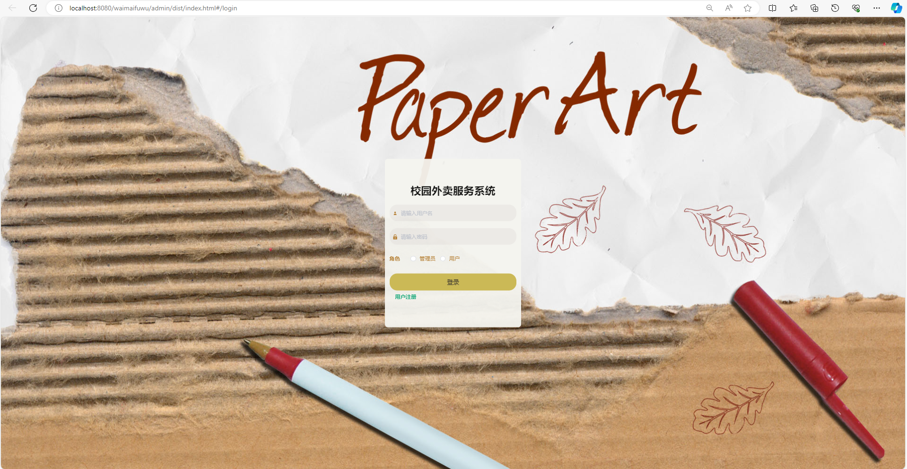
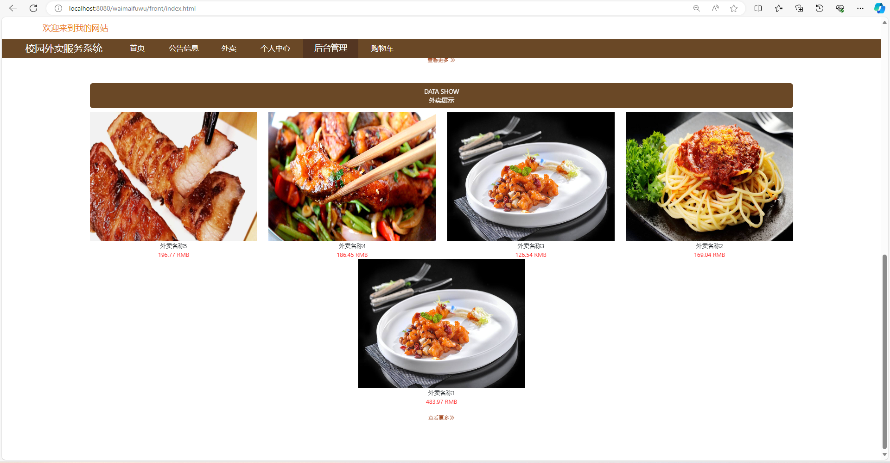
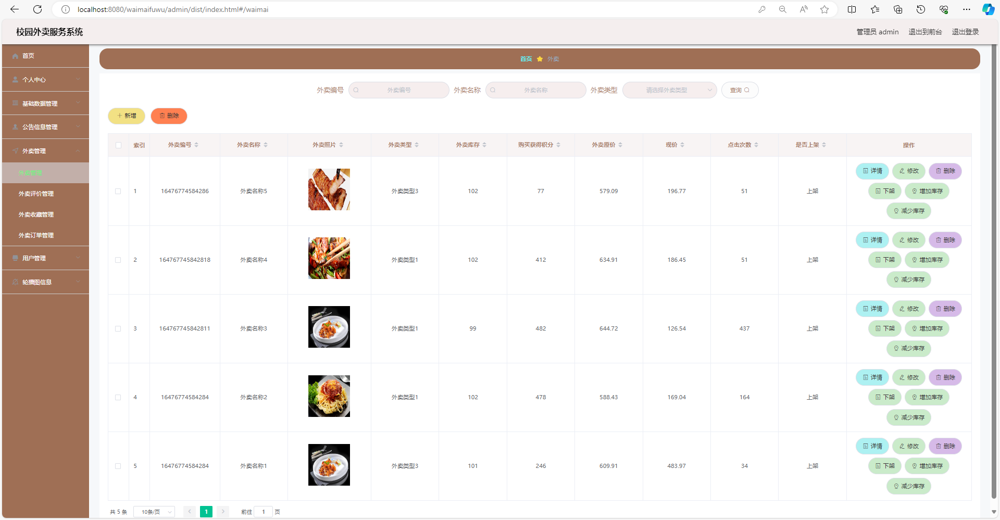
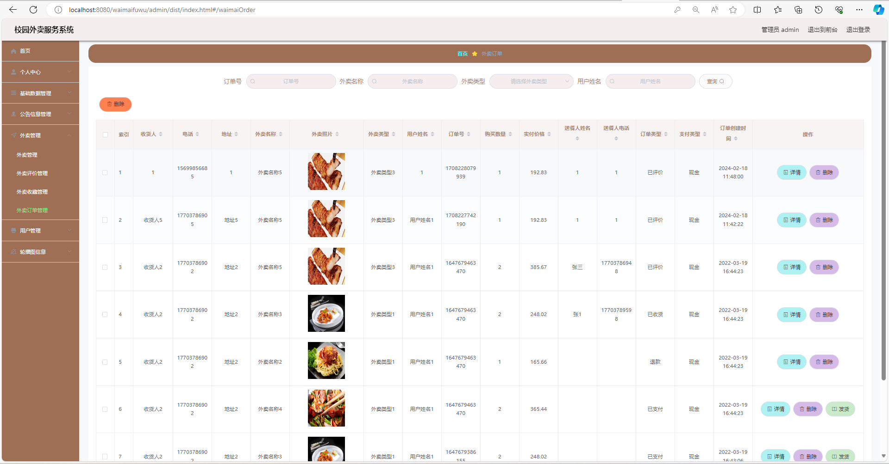
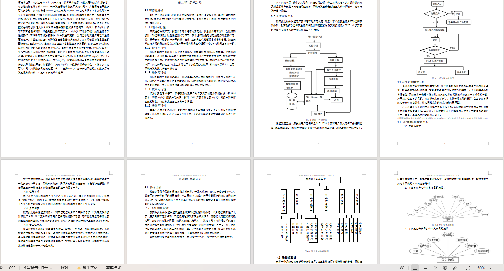

# 校园外卖服务平台带11000字项目文档

## 一、项目介绍

基于Springboot+vue的

开发语言：java

数据库:mysql

主要技术:Springboot,mybatis,mysql,vue,html

系统角色:用户 管理员

用户功能：注册、登录、首页、公告信息、外卖菜品、购物车、个人中心、外卖收藏、外卖订单、订单评价、修改密码

管理员功能：个人中心、公告类型管理、会员等级类型管理、外卖类型管理、公告信息管理、外卖评价管理、外卖收藏管理、外卖订单管理、用户管理、轮播图管理

### 完整项目获取

通过网盘分享的文件：校园外卖服务系统

链接: https://pan.baidu.com/s/1NwVbUPbmiAPJ6uh2sS3JoQ?pwd=d6v4 提取码: d6v4
--来自百度网盘超级会员v3的分享

通过网盘分享的文件：工具包

链接: https://pan.baidu.com/s/1YmdoJvkjoUjA75wvHLDZ6A?pwd=xm96 提取码: xm96
--来自百度网盘超级会员v3的分享

需要远程项目部署或项目修改和毕业设计也可联系（添加申请时请备注好来意）

通过网盘分享的文件：远程调试部署联系方式

链接: https://pan.baidu.com/s/1W0dDcoZmayG0c7USJDYBYg?pwd=nqd7 提取码: nqd7
--来自百度网盘超级会员v3的分享

### 项目合集(项目不断更新中)
链接: https://pan.baidu.com/s/1nY-zhvAK0CXYcn3g7LzQnQ?pwd=id3c 提取码: id3c
--来自百度网盘超级会员v3的分享

#### 这些项目一起发你了 可以分享给你需要的同学 调试可找我 也接二次修改和项目定制、毕业设计等

## 接毕业设计和论文

微信联系方式：xzxj0206  QQ：3808981644   (支持修改、 部署调试、 支持代做毕设)

接网站建设、小程序、H5、APP、各种系统等，单片机、嵌入式也可以做

选题+开题报告+任务书+程序定制+安装调试+论文+答辩ppt  都可以做

## 二、部分功能界面展示

## 三、万字文档参考

